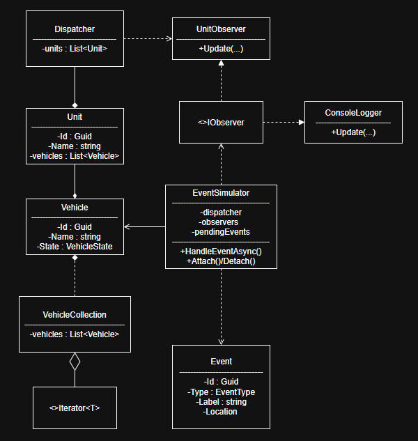

# FireDispatch – Fire Department Dispatch Simulator

This project presents a simple call management system for fire departments.

Emergency incidents appear on the map, and the app selects and dispatches the nearest available vehicles. Every stage of the operation is logged – from the call, through departure, arrival, and response, to return to the station. The system also recognizes the possibility of false alarms.

---

## Features:

- Generate random events (Pz, Mz, Af)
- Assign event identifiers (e.g., Mz-12)
- Dispatch the appropriate number of vehicles to a report
- Log unit actions (departure → arrival → actions → return)
- Handling false alarms (5% chance, quick return)
- Event queue when there are no available vehicles
- Statistics after the simulation is complete
- Design patterns: Strategy, Iterator, Observer
- Program runs asynchronously

---

## Technologies and Concepts:

- C# / .NET entire project
- Object-oriented programming broken down into models and logic
- Observer notifies loggers about events
- Strategy selects vehicle dispatch method
- Iterator browses vehicle collections
- Task/async await simulation of action and arrival times

---

## UML Diagram:


---

## How to run:
```
git clone <https://github.com/Zorquan04/fire-dispatch.git>
cd FireDispatchSolution/FireDispatch.App
dotnet run
```
After starting, simulation logs will appear in the console.

---

## Sample log:
```
[SKKM] New report: Pz-1 | Pz | (50,05759, 19,92713)
[LOG] [SKKM] Report accepted: Pz-1
[LOG] --- NEW REPORT: Pz-1 ---
[LOG] Location: 50,05759, 19,92713
[LOG] [JRG-1] Vehicle JRG1-V1 assigned to an report Pz-1
[LOG] [JRG-1] Vehicle JRG1-V2 assigned to an report Pz-1
[LOG] [JRG-1] Vehicle JRG1-V3 assigned to an report Pz-1
[LOG] [JRG-1] Vehicle JRG1-V1 on the way to the report Pz-1
[LOG] Vehicle arrival time JRG1-V1: 1,8s
...
```